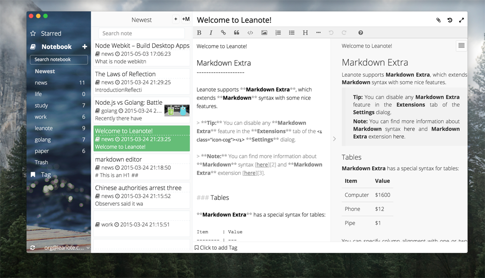

# Leanote Desktop App

Use node-webkit to create leanote desktop app.



## How to develop it

### 1. Install node-webkit

See https://github.com/nwjs/nw.js


### 2. How to run it

Download this project, and run

````
$> cd PATH-TO-LEANOTE-DESKTOP-APP/src
$> PATH-TO-NODE-WEBKIT/nw .
```

### 3. How to build it
```
$> cd PATH-TO-LEANOTE-DESKTOP-APP
$> npm install
$> gulp
```


## LICENSE
LEANOTE - NOT JUST A NOTEBOOK!

Copyright 2015 by the contributors.

This program is free software; you can redistribute it and/or modify
it under the terms of the GNU General Public License as published by
the Free Software Foundation; either version 2 of the License, or
(at your option) any later version.

This program is distributed in the hope that it will be useful,
but WITHOUT ANY WARRANTY; without even the implied warranty of
MERCHANTABILITY or FITNESS FOR A PARTICULAR PURPOSE.  See the
GNU General Public License for more details.

Leanote destop app is licensed under the GPL v2.

[LICENSE](https://github.com/leanote/desktop-app/blob/master/LICENSE)